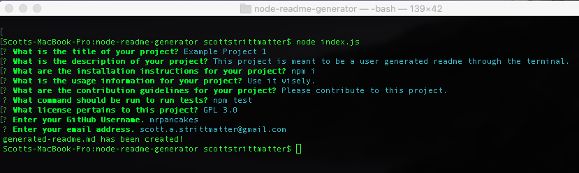

# Node Readme Generator

## Description

The purpose of this application is to use the Inquirer package with Node to create a user-generated readme file based on the user's input in the terminal.

The prompt asks the user the following questions:
* What is the title of your project?
* What is the description of your project?
* What are the istallation instructions for your project?
* What is the usage information for your project?
* What are the contribution guidelines form your project?
* What command should be run to run tests?
* What license pertains to this project?
    * This is multiple choice. If the user chooses None, then the license section is not visible.
* Enter your Github Username.
* Enter your email address.

Once the user has completed all questions, a readme will be generated entitled generated-reademe.md

## How To Use

Below is an overview of how to use this application:

* Install inquirer and fs through the terminal by running: npm i
* Open terminal on your desktop, cd into the directory, and run: node index.js
* Answers the questions that are prompted in your terminal, and see that a generated-readme.md file has been created in your directory with your inputs.

## More Info

You can watch a video demonstration of me running the app [here](https://www.youtube.com/watch?v=3uH9FdJJJok). A sample generated readme can be found in the /output folder in the repo.

